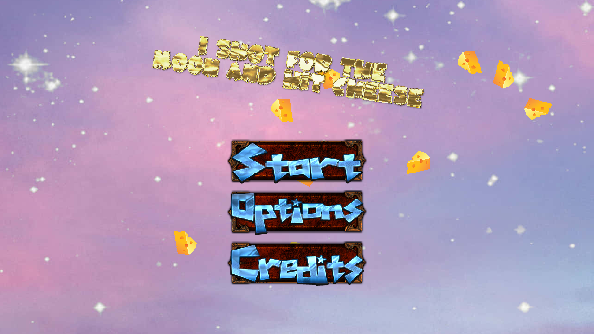
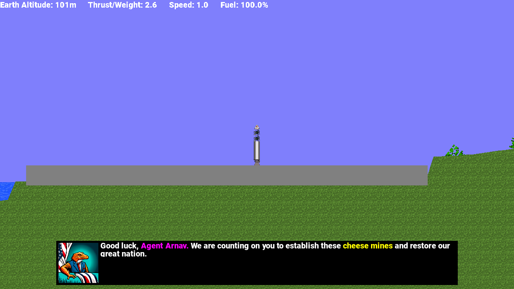
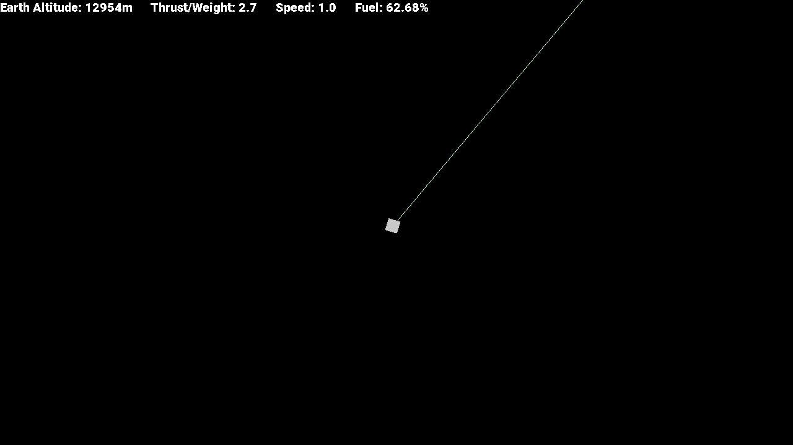
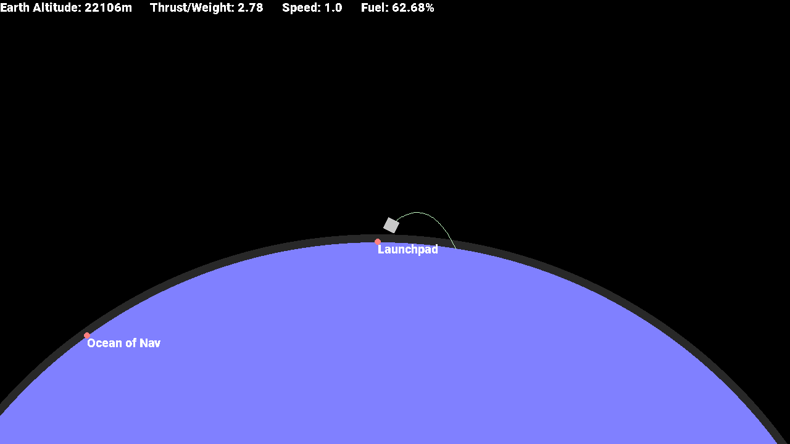
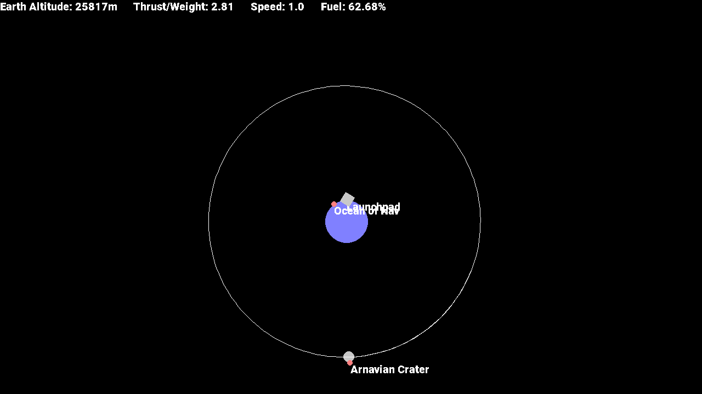
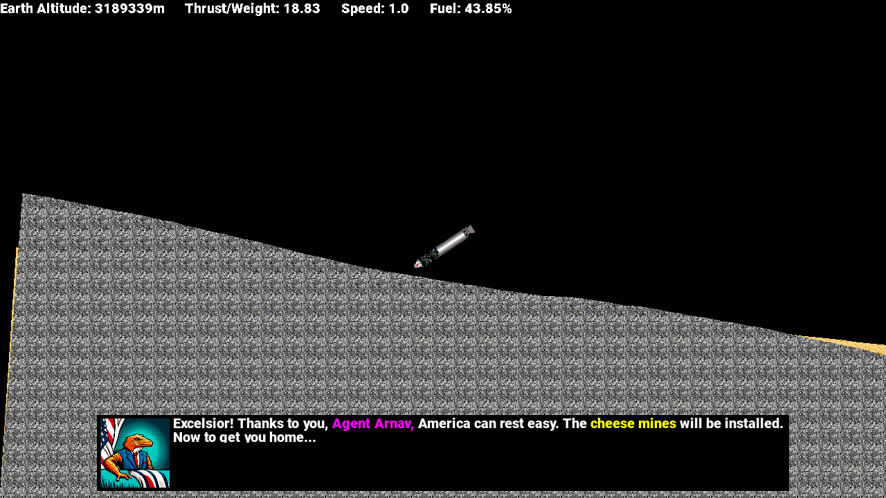

# I Shot for the Moon and Hit Cheese
Multistage rocket simulator that I created for an AP Phyiscs 1 project

PLOT: "The year is 20XX. Global cheese reserves are at an all time low ever since the last cow jumped over the moon 71 years ago. To prevent the imminent collapse of these Great United States, we have tasked you, Agent Arnav, with the mission of reestablishing the lunar cheese mines. Of course, we will provide you with the necessary resources and supplies, as well as the materials for your 'Galactose I'. Good luck, Agent. You are our only hope."

## Features
* Storyline with a plot and multiple characters
* Completely custom rocket creator with fuel and engine parts and staging capabilities
* Physics accurate rocket simulator with multiple graviational bodies and map of trajectories

## Screenshots

## Architecture
Engine is a self made bare-bones game loop that supports multiple scenes, sprites, animations, peripheral input, state machines for simple AI, and particle effects

## Installation
Simply download the build and run the exe file.

## Future Improvements
* Correct impulse-based physics solver that can support a lot of moving parts
* Flood fill algorithm for fuel tanks to accurately connect parts to engines
* Port the engine to something with opengl to increase performance significantly

## List of known issues:
* FPS drops to like 5 when you go to the side of a planet
* You can't burn from the map screen
* No saving and loading zia rocket :(
